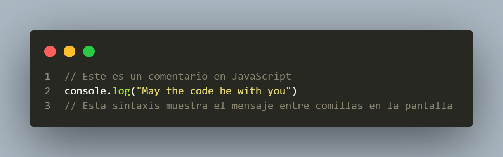

<!-- logo IMG -->

  

# **🛠️Git-PrimerTrabajoEquipo**

## 💡Acerca de  
 Este **proyecto**  es desarrollado para el estudio de la herramienta **GitHub**  y **VSC** para estudiantes de Ingeniería en Software de *Universidad Cuauhtemoc Querétato.*

### 🫵Instrucciones:
> #### **Seguir las siguientes instrucciones para que tengan un repositorio de Git por equipo.**

- Crear un primer repositorio de Git llamado Git-PrimerTrabajoEquipo
- Crear un archivo Readme.md donde guardarán la información de los integrantes del equipo
- Crear un archivo Principal
- Incluir los archivos con cambios en el "Stage" para posteriormente guardarlos con un commit con el nombre "Creación de Proyecto"
- Esta primera versión deberá ser subida a GitHub para que puedan trabajar en equipo, así que les recomiendo que una persona lo suba, y posteriormente les de acceso a sus compañeros de equipo.
- Cada integrante del equipo deberá crear un archivo con su nombre donde incluirán una función del archivo adjunto y del equipo asignado, deberán repartirse los ejercicios entre los miembros del equipo.
- Cada integrante deberá descargar la última versión de Github, y subir sus cambios al repositorio remoto.
- Cuando todos los integrantes hayan subido sus cambios, deberán modificar en equipo el archivo Principal, donde mandarán llamar todas las funciones que crearon.
- Posteriormente deberán crear una nueva rama llamada NuevaRama, y cambiarse a ella con "git 
switch NuevaRama"

- En la nueva rama actualizarán la información del archivo Readme.md y describirán los ejercicios que desarrollaron y como está compuesto su repositorio, lo guardarán en un commit, y regresarán a la rama principal.
- En la rama principal combinar la NuevaRama con el comando siguiente "git merge NuevaRama"
- Resolver los conflictos que surjan y guardar en un nuevo commit.
- Se cambiarán a los commits anteriores para guardar las versiones correspondientes, para cambiar entre commits deberán usar "git checkout ID_COMMIT" y pondrán las versiones con el comando "git tag -a NOMBRE_TAG -m MENSAJE "
- Para comprobar sus etiquetas podrán observarlas con "git tag" para ver la lista de todas las etiquetas, y con "git tag NOMBRE_TAG" verán la información de una etiqueta en específico
- Al final deberán subir todo al repositorio de GitHub
- Para subir los tags a GitHub se realiza a través del comando "git push origin --tags"

## **Funcion para palindromo by Regina** 
El usuario escribe la palabra y el programa la reescribe al reves, si es igual da como resultado "Palindormo"

## **Función Combinación DadosDados by Diego Castillo Salazar**
>Se define una función combinacionesDados que recibe un entero puntaje como parámetro.
Dentro de la función:
Se imprime un mensaje inicial indicando el puntaje objetivo.
Se utiliza un bucle anidado para iterar sobre todas las combinaciones posibles de los valores de dos dados (cada dado puede tener valores del 1 al 6).
Si la suma de los valores de los dos dados es igual al puntaje objetivo, se imprime la combinación y se marca la variable found como true.
Después de comprobar todas las combinaciones posibles, si no se encontró ninguna combinación que sume el puntaje objetivo, se imprime un mensaje indicándolo.

## **Función Triángulo by Tadeo**
Se incluyen las bibliotecas necesarias para el programa.

    #include "TadeoMauricioEscobarRivera.h": Incluye un archivo de cabecera personalizado que contiene declaraciones adicionales necesarias para el programa.
    #include <iostream>: Incluye la biblioteca estándar de C++ para la entrada y salida a través de flujos (como std::cin y std::cout).

Se define una función dibujarTriangulo que recibe un entero tamano como parámetro.

    void dibujarTriangulo(int tamano) {: Define la función que se encargará de dibujar un triángulo en la consola.

Dentro de la función:

    Se utiliza un bucle for para iterar sobre cada fila del triángulo.
        for (int i = 1; i <= tamano; ++i): Itera desde i = 1 hasta i = tamano, controlando el número de filas del triángulo.

Para cada fila, se imprimen espacios en blanco y asteriscos:

    Primero, se imprimen los espacios necesarios para alinear los asteriscos en forma de triángulo.
        for (int j = 0; j < tamano - i; ++j): Itera desde j = 0 hasta j < tamano - i, imprimiendo los espacios necesarios antes de los asteriscos.
            std::cout << " ";: Imprime un espacio en blanco en cada iteración.

    Después, se imprimen los asteriscos correspondientes a la fila actual.
        for (int k = 0; k < 2 * i - 1; ++k): Itera desde k = 0 hasta k < 2 * i - 1, imprimiendo los asteriscos necesarios para formar la fila del triángulo.
            std::cout << "*";: Imprime un asterisco en cada iteración.

Se imprime un salto de línea después de completar cada fila para pasar a la siguiente.

    std::cout << std::endl;: Imprime un salto de línea al final de cada fila, moviendo el cursor a la siguiente línea en la consola.

El bucle exterior finaliza después de iterar sobre todas las filas y dibujar el triángulo completo.

    }: Finaliza el cuerpo del bucle exterior.
    }: Finaliza la definición de la función dibujarTriangulo.

## **Función numeros Primos by Iber**

Se creó una clase

Esto veririca si es primo y luego devuelve los numeros primos en "n" numero primos

En el cpp se crea el codigo para sacar si es primo

### 📣Este Proyecto esta conformado por:
---
+  IBER ARMANDO SILVA GONZALEZ (<Isilva37731@ucq.edu.mx> )
+ DIEGO CASTILLO SALAZAR (<dcastillo35389@ucq.edu.mx>)
+ LORENA REGINA GARCIA FELIX (<lgarcia32381@ucq.edu.mx>)
+ TADEO MAURICIO ESCOBAR RIVERA (<tescobar38642@ucq.edu.mx>)

